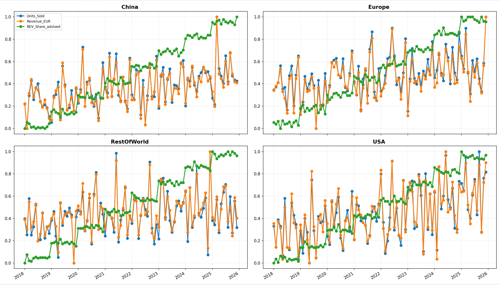
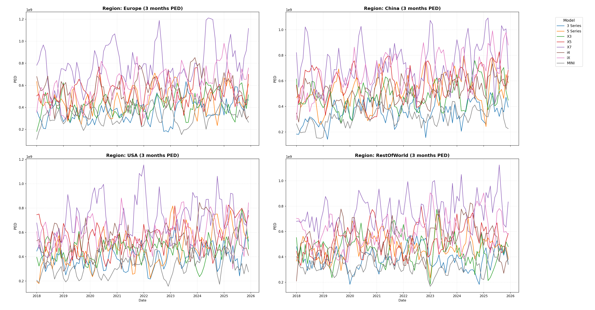
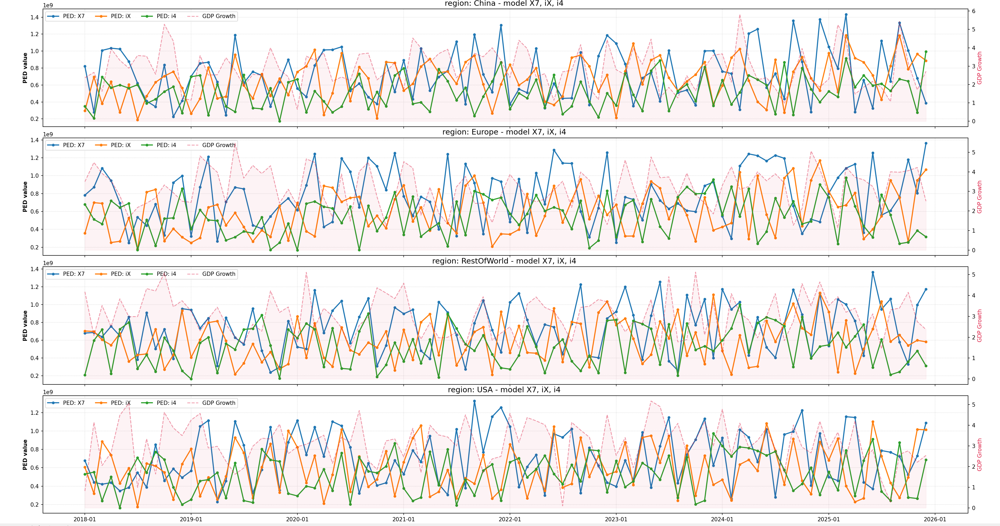
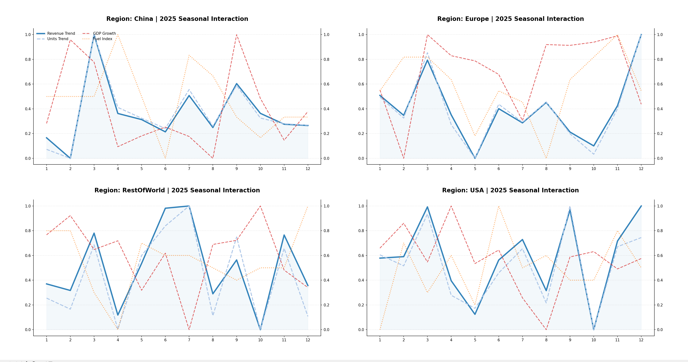
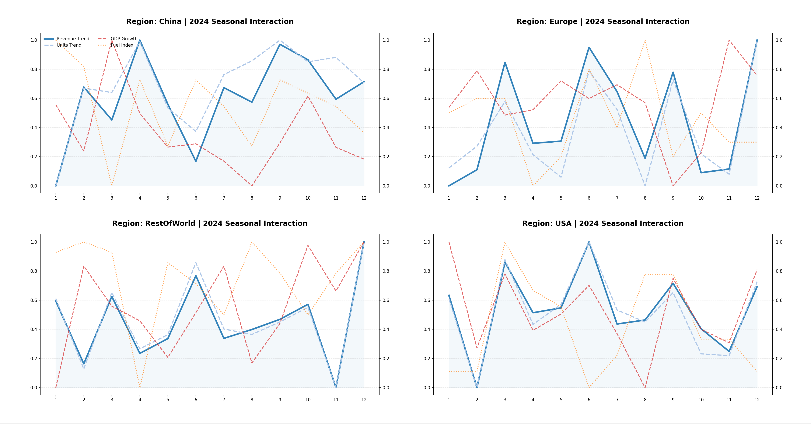

### Note on Data Scaling: The data in these charts has been normalized to a scale of 0.0 to 1.0.

# Q_A: 
## How does BEV_Share growth over time (2018–2025) correlate with Units_Sold and Revenue_EUR across different regions, and which region shows the strongest transition toward electrification?

Running q1.py have a Line chart to show these different trends of regions. 

Based on the charts provided for 2018–2025, here is a concise analysis:

Correlation Analysis
Decoupled Short-term: Units_Sold (Blue) and Revenue_EUR (Orange) are highly correlated with each other, showing significant seasonal volatility. However, they show low short-term correlation with BEV_Share (Green), which grows in a steadier, "step-like" progression.

Long-term Positive Growth: In the long run, there is a strong positive correlation. As the green line (electrification) ascends, the baseline for both units and revenue remains resilient, suggesting EVs are successfully replacing internal combustion engine (ICE) volumes.

Regional Performance
China: Shows the earliest and most stable "step" increases, reaching the 1.0 threshold fastest.

Europe: Exhibits a very consistent upward slope with high integration between sales volume and EV adoption.

USA: Started slower but shows the most aggressive growth gradient (steepest slope) after 2022.

Rest of World: Displays the most lag, with significant growth only appearing after 2024.

Conclusion
China shows the strongest and most mature transition toward electrification. It was the first region to achieve a high "plateau" in BEV_Share (near 1.0) by 2025, demonstrating lead-time advantage and market stability compared to other regions.

--------------------------------------------------------
# Q_B:
## Which models demonstrate the highest price elasticity, based on changes in Avg_Price_EUR vs Units_Sold, and how does this vary across economic conditions (GDP_Growth levels)?

We can run q2.1.py to get the chart that shows these models: "X7", "iX", "i4"  have highest price elasticity, 
and run q2.1.py to get the correlation with s economic conditions.

Price Elasticity of Demand (PED) measures how sensitive Units_Sold is to changes in Avg_Price_EUR. High PED values indicate high sensitivity.
Top Elastic Model: X7 (Purple/Blue lines). In all regions (China, Europe, USA, RestOfWorld), the X7 consistently maintains the highest PED values, often peaking near the $1.0$ normalized mark. As a high-end luxury model, its demand is significantly more sensitive to price adjustments compared to entry-level models.
Secondary High Elasticity: i4 & iX (Pink/Green lines). These electric models show rising elasticity over time, particularly in Europe and China, reflecting a highly competitive EV market where consumers are sensitive to price premiums.

--------------------------------------------------
# Q_C：
## Can we identify seasonal patterns (Month-level trends) in Revenue_EUR and Units_Sold, and do these patterns interact differently with regional economic indicators (GDP_Growth, Fuel_Price_Index)?

We can run q3.py with diff year num to show the correlations of items.

Based on the 2024 and 2025 Seasonal Interaction charts, here is the concise English analysis:

1. Seasonal Patterns (Month-level)
Q1 Slump & March Surge: Across all regions, January and February consistently show the lowest activity, followed by a sharp recovery in March.

The December Peak: December is the strongest month globally, with both Units_Sold and Revenue_EUR frequently hitting the normalized 1.0 mark.

Quarterly Rallies: Secondary peaks often appear in June and September, likely driven by end-of-quarter sales targets.

2. Interaction with Economic Indicators
GDP Growth (Red Dashed Line):

China: Shows the strongest pro-cyclical interaction. Sales spikes are tightly synchronized with GDP growth peaks.

USA: Appears more decoupled. Holiday-driven consumer behavior (December) tends to override immediate GDP fluctuations.

Fuel Price Index (Yellow Dotted Line):

Europe & China: Show a notable inverse relationship. High fuel prices often act as a "drag" on sales volume, creating visible dips in the blue trend lines.

USA: Exhibits lower sensitivity to fuel prices compared to the dominant year-end seasonal surge.

Seasonal patterns are highly predictable, defined by a "March Rebound" and a "December Peak." These patterns are GDP-driven in China but more sensitive to Fuel Prices in Europe, where energy costs significantly impact consumer demand.